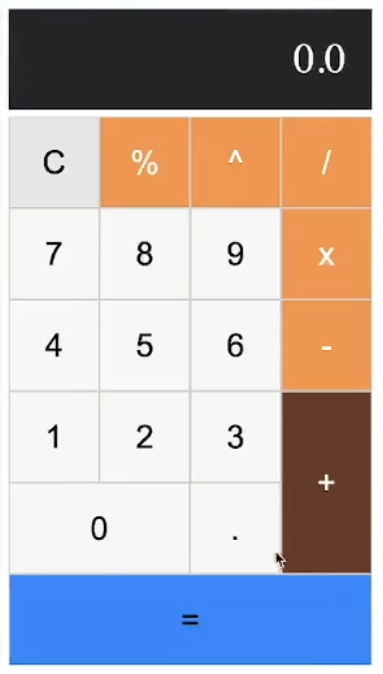

# 🧮 Calculator UI (HTML + CSS | Flexbox)

A fully responsive **Calculator UI** designed using **Flexbox** and a **mobile-first approach**.  
This project helped me master core Flexbox concepts, build identical aspect-ratio buttons, and implement responsive design using media queries.

 <!-- Optional: Add a screenshot -->

---

## 🚀 Features

- 🎯 Fully responsive design (mobile-first + media queries for larger screens)
- 📐 Identical square-like buttons using `aspect-ratio`
- 📦 Layout powered completely by **Flexbox**
- 🧹 Clean and semantic HTML5 structure
- 🎨 Minimal and user-friendly interface

---

## 🛠 Tech Stack

| Technology | Purpose                    |
|------------|-----------------------------|
| HTML5      | Structure of the calculator |
| CSS3       | Styling, Flexbox layout, responsiveness |

---

## 📚 What I Learned

- Deep understanding of **Flexbox** layout system
- Using **`aspect-ratio`** to maintain consistent button dimensions
- Building **mobile-first** responsive designs
- Writing clean and scalable CSS with **media queries**
- Handling alignment, spacing, and wrapping of flexible items

---

## 📋 Important Flexbox Properties Cheat Sheet

| Property                | Purpose                                           |
|--------------------------|---------------------------------------------------|
| `display: flex;`         | Defines a flex container                         |
| `flex-direction`         | Sets the direction of flex items (`row`, `column`)|
| `justify-content`        | Aligns items horizontally (`center`, `space-between`, etc.) |
| `align-items`            | Aligns items vertically (`stretch`, `center`, `flex-start`) |
| `flex-wrap`              | Allows items to wrap onto multiple lines         |
| `gap`                    | Adds spacing between flex items                 |
| `flex-grow`              | Defines how much a flex item should grow         |
| `flex-shrink`            | Defines how a flex item should shrink if needed  |
| `flex-basis`             | Sets the initial main size of a flex item        |
| `align-self`             | Overrides align-items for individual items       |

> 📖 **Tip:** Mastering just these properties can solve 90% of layout challenges in modern web design!

---

## 📁 Project Structure

```bash
calculator-ui/
│
├── index.html         # Calculator UI layout
├── style.css          # Styling and Flexbox layout
└── README.md          # Project documentation
